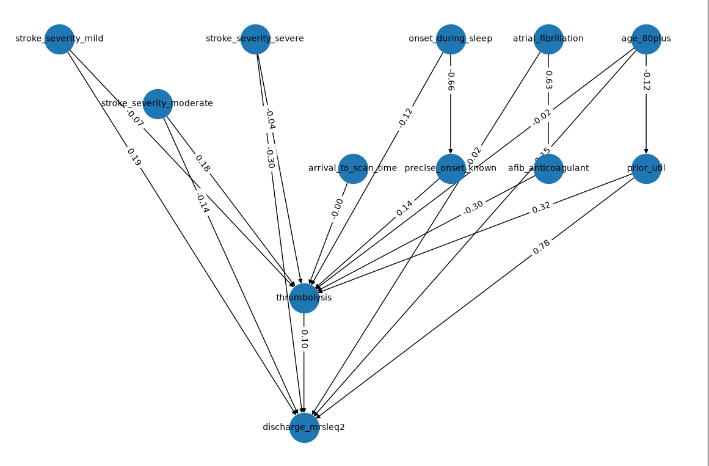

<h2>

🧠🔗Causal Discovery for stroke data🔗🧠

</h2>

*Exploring causal discovery methods for understanding factors influencing outcomes after stroke*

<h3>

About the Project

</h3>

Stroke outcomes are influenced by a complex combination of patient characteristics, clinical factors, treatment decisions and timings throughout the stroke pathway. However, observational healthcare data primarily shows us associations and patterns.

The key question explored in this project is:

**💭 Can causal discovery methods help us move from simply identifying relationships in stroke pathway data towards understanding the underlying causal structure?**

This project investigates causal discovery methods using synthetically generated data with known causal relationships.
Because the true causal structure is known in the simulated data, the performance of causal discovery algorithms can be evaluated by comparing the DAG discovered by the algorithm with the true underlying DAG.

<h3>

🏥 Why Stroke?

</h3>
Stroke care involves a complex sequence of events. A patient’s outcome may depend on:

* 👤 Patient characteristics
* 🚑 Emergency presentation
* 🧠 Stroke severity
* 🏥 Stroke team 
* 💊 Treatment decisions
* ⏱️ Arrival to scan timings
* ❤️ Patient outcome

Understanding the underlying relationships could potentially help identify which factors are genuinely driving outcomes, rather than simply being associated with them.

🎯 **Aim**: The overall aim is to investigate whether causal discovery algorithms can accurately recover known causal relationships from data.

<h3>

🔗 Directed Acyclic Graphs (DAGs)

</h3>
A Directed Acyclic Graph (DAG) provides a visual representation of causal relationships.
For example:

<h3>

🌳 The True DAG

</h3>
Because the data is simulated, the underlying causal structure is known.
This provides a baseline against which causal discovery algorithms can be evaluated.

<h3>

🧪 Synthetic Data Generation

</h3>
One of the central parts of the project is generating data where the true causal structure is known in advance. This allows the analysis to answer a question that is difficult to answer using real-world observational data:

**🔍 If we know the true causal relationships, can the algorithm find them?**

